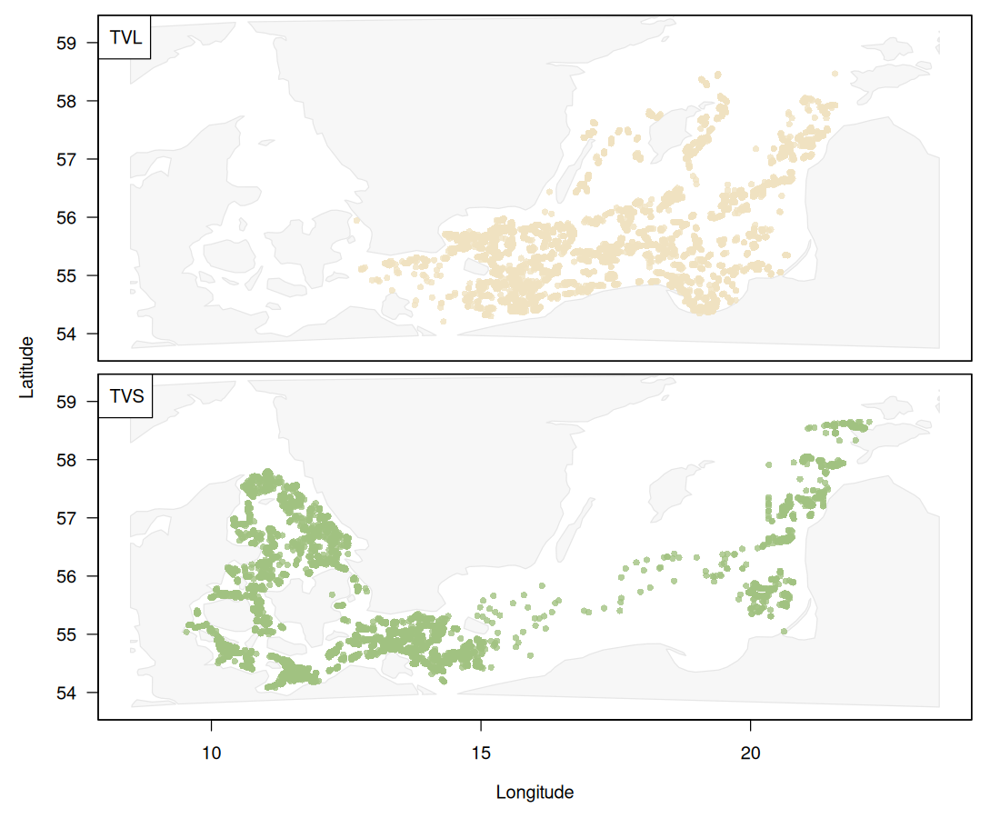
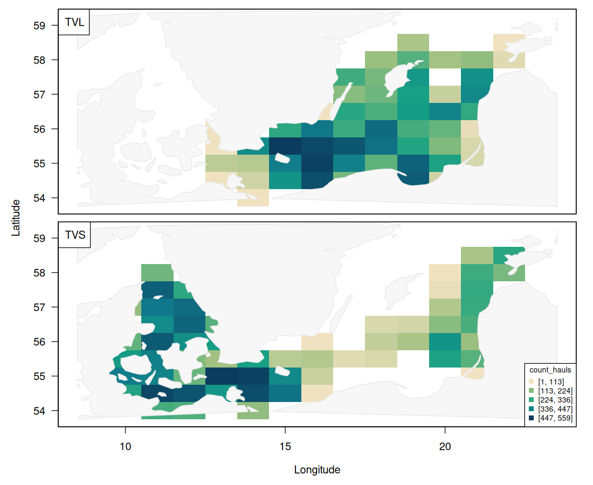
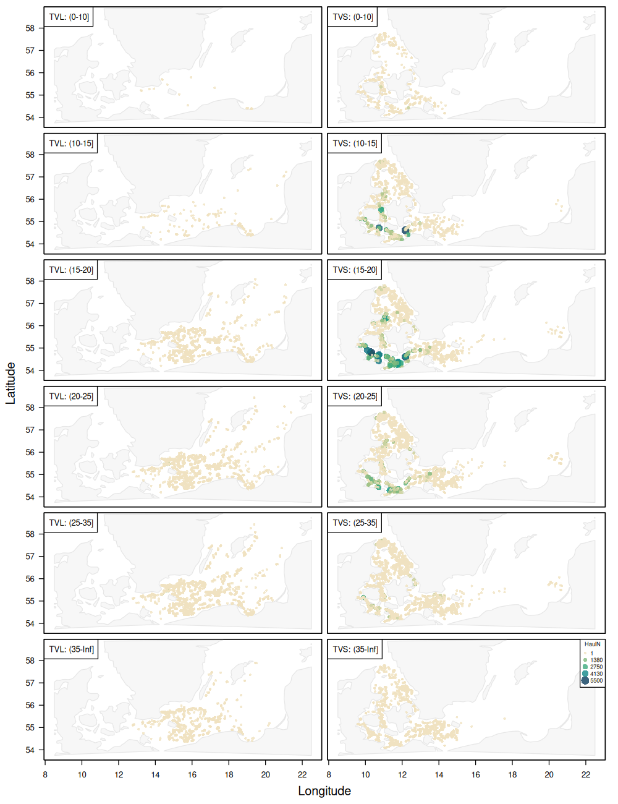

# Gear efficiency: TVL vs. TVS for plaice in the Baltic

## Methodological challenge

Survey data are often collected using multiple vessels and gear types. Differences in gear efficiency can introduce systematic biases into abundance indices, species distribution models, and trend analyses.

In this dataset, all observations originate from the same survey but two
different gears: a large TV trawl (TVL) and a small TV trawl (TVS) (Fig. 1).

The spatial distribution of the numbers of hauls by gear is shown in Fig. 2.

Combining observations obtained by different gears is important when working
with ICES DATRAS. Can we assume that swept area accounts for all differences or
might there still be important unaccounted differences between gears that we
should account for? This data set could serve as an exploration of this
question. Specific questions could be:

* How does the catch efficiency differ among TVL and TVS?
* Can the gear efficiency be estimated reliably?
* Does it differ by length?

## Data sources

* Source: ICES DATRAS
* Survey type: BITS (Baltic International Trawl Survey)
* Years: 1999–2024
* Taxonomic scope: (Pleuronectes platessa)
* Response variables:

  * Numbers-at-length
  * Weight-at-length

## Key variables

| Variable   | Description                       |
|------------|-----------------------------------|
| year       | Survey year                       |
| quarter    | Survey quarter                    |
| haul_id    | Unique haul identifier            |
| gear       | Beam trawl gear identifier        |
| vessel     | Survey vessel                     |
| lon        | Haul longitude                    |
| lat        | Haul latitude                     |
| depth      | Haul depth (m)                    |
| swept_area | Estimated swept area              |
| length     | Length group                      |
| numbers    | Number caught in the length class |
| weight     | Total weight in the length class  |

## Assumptions

1. Species identification is correct.
2. Position and sampling metadata are accurate.
4. Environmental effects are either negligible or can be modelled separately.
5. Differences among gears reflect differences in catchability rather than stock
   abundance.

Please critically evaluate whether these assumptions are reasonable.

